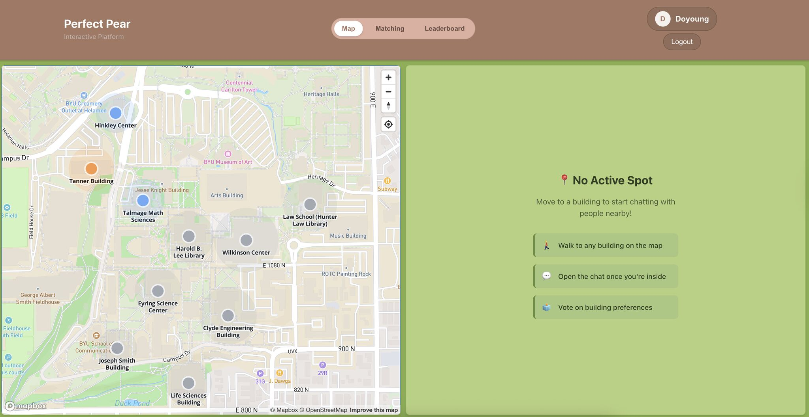

# 2025 Fall BYU Homecoming Hackathon




React 프론트엔드와 Node.js 백엔드로 구성된 기본적인 웹 애플리케이션입니다.

## 프로젝트 구조

```
├── frontend/          # React 프론트엔드
│   ├── public/
│   ├── src/
│   └── package.json
├── backend/           # Node.js 백엔드
│   ├── server.js
│   └── package.json
└── README.md
```

## 기능

- **백엔드**: Express.js 서버와 헬스체크 API (`/api/health`)
- **프론트엔드**: React 기반 기본 페이지와 백엔드 연결 테스트

## 설치 및 실행

### 1. 백엔드 실행

```bash
cd backend
npm install
npm start
```

백엔드는 `http://localhost:5000`에서 실행됩니다.

### 2. 프론트엔드 실행

새 터미널에서:

```bash
cd frontend
npm install
npm start
```

프론트엔드는 `http://localhost:3000`에서 실행됩니다.

## API 엔드포인트

- `GET /` - 기본 API 정보
- `GET /api/health` - 서버 상태 확인

## 개발 모드

개발 중에는 nodemon을 사용하여 백엔드 자동 재시작이 가능합니다:

```bash
cd backend
npm run dev
```

## 기술 스택

- **프론트엔드**: React 18, CSS3
- **백엔드**: Node.js, Express.js, CORS
- **개발 도구**: Nodemon (개발 모드)
